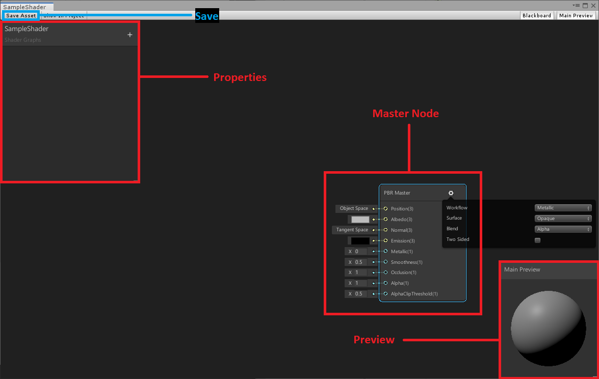

# Unity Shader Graph

### แล้วมันคืออะไร 
  *" ผิดพลาดตรงไหนขออภัยด้วยเขียนตามความเข้าใจของตัวเอง แต่คิดว่าไม่น่าพลาด "*

 ก่อนอื่นเลยเราต้องมารู้จักกับสิ่งที่เรียกว่า **Shader** กันก่อน Shaderคือโค้ดที่เอาไว้สำหรับแสดงผลต่างๆของ Material ของเราใน Unity ซึ่ง Material ทุกอันจำเป็นต้องมี Shader ถ้าไม่มี Model หรือ UI ของเราจะกลายเป็น สีชมพู ซึ่งใน Unity นั้นจะมี Shader เริ่มต้นมาให้แล้ว แต่ว่าอาจจะไม่ตรงความต้องการของเราเราจีงต้องจำเป็นต้องเรียนรู้เกี่ยวกับ Shader Editor นั่นเอง

**Shader Editor** ของตัว Unity เองเป็น Node Visual ซึ่งที่ผ่านมา Unity ไม่เคยมี Shader Editor ของตัวเอง
ทำให้การเขียน Shader เองนั้นทำได้ยากสำหรับผู้ที่ต้องการเริ่มต้นใหม่ Shader Graph จำเป็นต้องใช้คู่ไปกับ BuildPipeline ตัวใหม่ของ Unity 

# Pro/Cons
### ข้อดี
 * **BuildPipeline** อันใหม่ตรงตามการใข้งานของผู้ใช้ ด้วย Performance สูงสุด

 * **Base on HLSL** คือ Shader Graph เป็น HLSL(High Level Shader Language)ตั้งแต่แรก ซึ่งShader Languageเก่าของ Unityนั้นเป็น CG ซึ่งเวลานำไป 
     ใช้งานนั้น Program จะแปลงจาก CG ไปเป็น HLSL หรือ GLSL ตาม Platform ที่ใช้งานอยู่ดี และสุดท้ายคือ Nvidia เลิกซัพพอท CG แล้ว

 * **Native** เพราะเป็น Native ของUnityเอง ทำให้Community และการแก้บัคต่างๆ ได้รับการแก้ไขและพัฒนาเพิ่มตลอดเวลา
### ข้อเสีย
 * **Feature** ยังน้อยอยู่ยังทำบางอย่างไม่ได้ ในตอนนี้ต้องรออัพเดทในอนาคต
 * **Bug** ยังมีบัคแปลกๆบางอย่างที่ทำให้ตัว Editor มีปัญหาหรือ Node แสดงผลไม่ถูกต้องรอการแก้ไขต่อไป

***
# How to Install

Shader Graph นั้นเราต้องลงผ่าน **Package Manager**
และจำเป็นต้องลงRender Pipeline ตัวใหม่ก่อนมีให้เลือกระหว่าง

**Lightweight Render Pipeline**

**High-Definition Render Pipeline**

หลังจากนั้นค่อยลง **Shader Graph**

โดยไปที่ Menu Window > Package Manager 

หลังจากนั้น เลือก Advanceแล้วเลือก Show preview packages 

* ลง Package ของ RenderPipeline ที่อยากได้ (แนะนำ Lightwieght ก่อนสำหรับมือใหม่)
* ลง Package Shader Graph

ขั้นต่อมาเราจะทำการสร้าง RenderPipeline สำหรับProjectของเราเอง

 * Menu > Assets > Create > Rendering > Lightweight Render Pipeline Asset เราจะได้ ตัว PipelineAssetของเรามา ตั้งชื่อตามสะดวก

 * ไปที่ Project Setting 
 * เลือกหัวข้อ Graphics 
 * ช่อง Scriptable Render Pipeline Settings Browse ไปหา Pipeline Asset ที่เราสร้างเมื่อกี้

**Note** สำหรับคนขี้เกียจก็ Clone ลงไปเลย

***

# How to Create

 * Menu > Assets > Create > Shader > PBR Graph เราก็จะได้ไฟล์ Shader ของเรามา
 * ตั้งชื่อให้เรียบร้อย แล้วดับเบิลคลิ้ก หรือ **Open Shader Editor** ใน Inspector ของไฟล์Shader
 * ถ้าเราลง Pipeline ถูกต้อง Unityจะเปิดหน้า Editor ของ Shader ให้

***
# Shader Graph Editor

 เปิดมาเราจะเจอ Node แรกชื่อ **PBR Master** เราจะเรียก Node นี้ว่า **Master Node** และที่ว่างๆเราขอเรียกมันว่า **Canvas**  

### Master Node

เป็น Node ที่ประกอบไปด้วย Setting และ Output ของ Shader
 
**Setting** รูปเฟืองข้างหลัง Master Node 

* **WorkFlow** คือ การตั้งค่าของการสะท้อนแสงบนพื้นผิวของ Shader
    * Metallic พื้นผิวแบบโลหะ จะสะท้อนแสงตามปกติ แสงเข้ามาสีอะไรก็จะสะท้อนบนวัตถุเป็นสีนั้น
    * Specular จะมีความมันวาวเป็นพิเศษ ใช้ควบคู่กับ Specular Map เพื่อควบคุมความมันวาวและสีที่สะท้อนออกไป ทำให้เราสามารถกำหนดสีของแสงที่ออกมาหลังจากกระทบกับวัตถุได้นั่นเอง

*  **Surface** ลักษณะพื้นผิว

    * Opaque ทึบแสง
    * Transparent โปร่งแสง

* **Blend** Blend Mode ของ Shader
* **Two Sided** ทำให้ Shaderของเรา Render Backface 

**Output**

 เป็นที่ๆเอาไว้สำหรับลาก Nodeต่างๆ ที่เราทำมาใส่ ตามช่องต่อไปนี้

*เลือกมาเฉพาะที่ใช้บ่อย*

 * **Albedo** สีของวัตุถุ
 * **Emission** สีที่เรืองแสงออกมาจากวัตถุ
 * **Normal** ค่า Normal ของวัตถุ
 * **Alpha** ค่า Alpha ของ Obejct 
 * **AlphaClipThreshold** ค่า AlphaClip ของ Object 

หลังจากเราลากเส้นจาก Nodeมาใส่ตามที่เราต้องการแล้วให้กด Save เพื่อเชคว่ากับในหน้าต่าง Scene หรือ Game ว่าผลออกมาตามที่เราต้องการหรือไม่

### Properties

เป็นที่สำหรับส่งค่าต่างๆ ออกไปให้ใน Editor เอาไว้ Setค่าหรือเขียนโค้ดต่างๆ เราสามารถกดปุ่มเครื่องหมาย + ด้านขวาเพื่อเพิ่ม Properties ที่เราต้องการ
Properties แต่ละแบบจะมีส่วนสำคัญๆ คือ
 
* **Name** ชื่อของ Property ที่ใช้ใน Shader Graph
* **Reference** ชื่ออ้างอิงสำหรับการใช้ Set value ผ่านการcoding *ถ้าเราไม่ใส่ _ ไว้ข้างหน้าReference ตัว ShaderGraphจะทำการใส่ให้โดยอัตโนมัติ
* **Default** ค่าเริ่มต้นของ Property

Proterties ที่ใช้ส่วนใหญ่ได้แก่ 

* **Vector1** แทนค่า Float สามารถทำเป็น Slider Min Max โดยการปรับ **Mode** เป็น Slider
* **Vector2 , 3 ,4 ** แทนค่า Vector ถึงแม้ว่าเราจะเลือก Vector2 หรือ Vector3 ใน Unity Editor จะแสดงผลเป็น Vector4 เสมอ เช่น ถ้าเราเลือก Vector2 จะมีค่า x y z w มาให้ แต่ โปรแกรมจะนำไปใช้เฉพาะ x y เท่านั้น
* **Color** ค่าสี สามารถปรับเป็น HDR ได้โดยการเปลี่ยน Mode
* **Texture** รูปภาพต่างๆที่เอามาใช้แสดงผล ไม่ว่าจะเป็น Texture ปกติหรือ Normal Map หรือ Emission Map อะไรก็แล้วแต่ที่เป็นรูปภาพจะใช้ Propertiesนี้ *ถ้าใช้เป็น Normal Map ต้องเปลี่ยน Mode เป็น Bump ด้วย

เราสามารถลาก Propertiesของเราลงไปไว้ใน Canvas ได้เลยถ้าต้องการใช้

### Node

เป็น Node ปกติที่เราจะใช้ สามารถสร้างโดยการ คลิ้งขวาในพื้นที่ว่างเลือก Create Node แบ่งออกเป็นหลายประเภทและ ถ้าเราทำบ่อยแล้วเราสามาถค้นหา Nodeที่ต้องการได้เลยในช่อง Search โดยแต่ละ Node นั้น ฝั่งทางซ้ายจะเป็น Input ทางขวาจะเป็น Output เราไม่สามารถลากจากฝั่งขวาใส่ฝั่งขวาได้

**Input > Basic**
  *เลือกมาเฉพาะที่ใช้บ่อย*
 
 * **Vector 1 ,2 ,3 ,4** ค่า Vector แต่ละแบบที่ Unityแยกออกมาให้ ซึ่งแท้จริงแล้วใน HLSL มีแค่ Vector4 หมายความว่าต่อให้เราเลือก Vector1 สุดท้ายแล้วจะถูกแปลงให้เป็น (x,0,0,0) อยู่ดีจึงเป็นสิ่งที่ต้องระวังเล็กน้อยเวลาใช้ Vector

 * **Color** สี เป็นค่า Vector 4 ที่ถูกแปลงให้เป็น (R,G,B,A) 

 * **Time** ค่าเวลา Time มีให้เลือกหลายแบบแล้วแต่การใช้งานของเรา 

**Input > Texture**

 * **Texture 2D Asset** ค่า Texture2d ก็คือรูปปกติทั่วไป

 * **Sample Texture 2D** ค่า Texture2D ที่มีการเอามารวมกับ UV และ SamplerMode แล้วกลายเป็น RGBA และเราสามารถกำหนดโหมดของ Textureได้
 
     * Default คือ เอาค่าเริ่มต้นจาก Texture ที่รับมา
     * Normal คือ ใช้ Textureนี้เป็นค่า Normal
 
**Math > Basic**

 * **Add** การบวกค่าระหว่าง A และ B (A + B)
 * **Multiplier** การคูณค่าระหว่าง A และ B (A x B) 
 * **Subtract** การลบค่าระหว่าง A และ B  (A - B)
 * **Divide** การหารค่าระหว่าง A และ B (A ÷ B)
 
**Math > Range**

 * **One Minus** การ Invert ค่า Input หรือ การเอา -1 เข้าไปคูณกับ Input Value นั่นเอง
 * **Remap** การขยับ Value Range ของเรา ไปเป็น Rangeใหม่ตามที่เราต้องการ คล้ายๆ การเทียบบัญญัติไตรยางศ์ แบบเป็น Min Max
 * **Clamp** การคุม Input Value ของเราไม่ให้ ต่ำเกินค่า Min หรือมากเกินค่า Max 
 
**Math > Trigonometry**

 * **Sine** การเอา Input Value มาเข้าสมมการ Sine แล้วออกมาเป็น Output (*ก่อนจะใช้ node นี้ node ที่ผ่านมาจำเป็นต้องมี node Time มาก่อน* )

***

# Note #

  * หากมีคำถามหรือข้อสงสัยรบกวนติดต่อผ่าน E-mail **Gittitat@praneat.com** 
  
  * หากสนใจร่วมงานกับเราติดต่อผ่าน **hr@praneat.com** ขอบคุณครับ

	 
